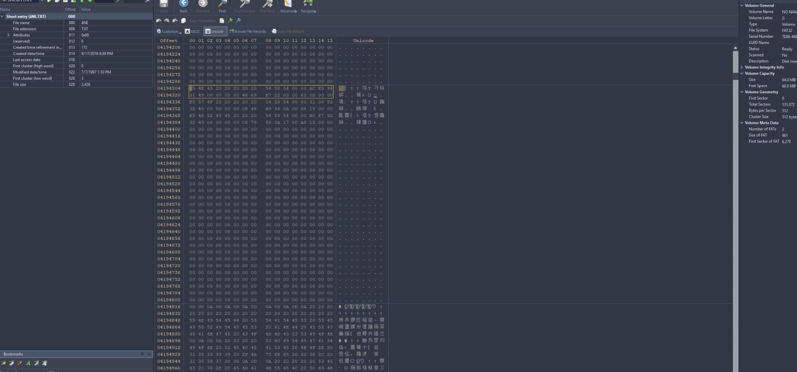
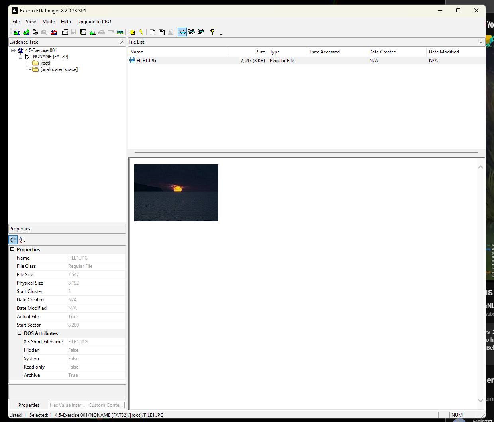
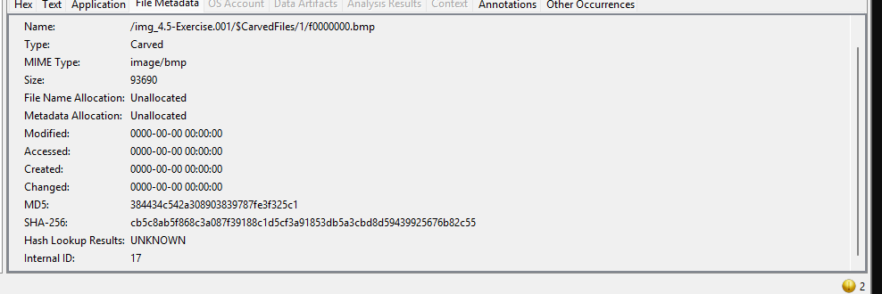

# FAT32 Deleted File Recovery Lab

A portfolio project based on digital forensics coursework involving FAT32 file-system structures, deleted directory entries, cluster chains, hex-level analysis, and recovery workflow documentation.

## Coursework Focus

This project reflects hands-on class exercises using **Active@ Disk Editor**, **FTK Imager**, and FAT32 disk images. The work included examining directory entries, identifying deleted files, interpreting FAT chains, calculating offsets, and restoring deleted directory entries in a controlled lab environment.

## Skills Demonstrated

- FAT32 file-system analysis
- Deleted file and directory entry recovery
- Hexadecimal offset interpretation
- Cluster-chain reconstruction
- Boot sector interpretation
- FAT table analysis
- Directory entry structure analysis
- FTK Imager validation
- Active@ Disk Editor
- Digital evidence documentation

## Lab Highlights

The coursework included recovery of deleted entries by modifying the FAT directory-entry deletion marker and reconstructing file metadata. One exercise involved entries such as:

- `_NE.TXT`
- `_WO.TXT`
- `_HREE.TXT`

Another exercise involved reconstructing a deleted JPEG (`FILE1.JPG`) from a FAT32 image.

## FAT32 Parameters Used in Coursework

- Bytes per sector: 512
- Sectors per cluster: 8
- Cluster size: 4096 bytes
- FAT1 offset: `0x0036D400`
- FAT2 offset: `0x003B6A00`

These values were used to navigate FAT structures and understand how logical clusters map to physical offsets.

## Repository Structure

```text
FAT32-Deleted-File-Recovery-Lab/
├── README.md
├── analysis/
├── docs/
├── scripts/
├── screenshots/
│   ├── active-disk-editor-directory-entry.png
│   ├── ftk-imager-recovered-file.png
│   └── autopsy-carved-file-metadata.png
└── sample-data/
```

## Important Note

This repository documents coursework methodology and recreates the technical concepts from the lab. It does **not** distribute the original course disk image or proprietary lab materials.

## Coursework Screenshots

The images below are the original screenshots from the coursework, displayed without alteration.

### Active@ Disk Editor — FAT32 directory-entry analysis



Hex-level examination of the FAT32 image while locating and interpreting a deleted directory entry.

### FTK Imager — recovered FILE1.JPG



FTK Imager view showing the recovered `FILE1.JPG` and its file-system properties.

### Autopsy — carved file metadata



Autopsy metadata view for a carved image from the forensic image, including file size and cryptographic hash values.
