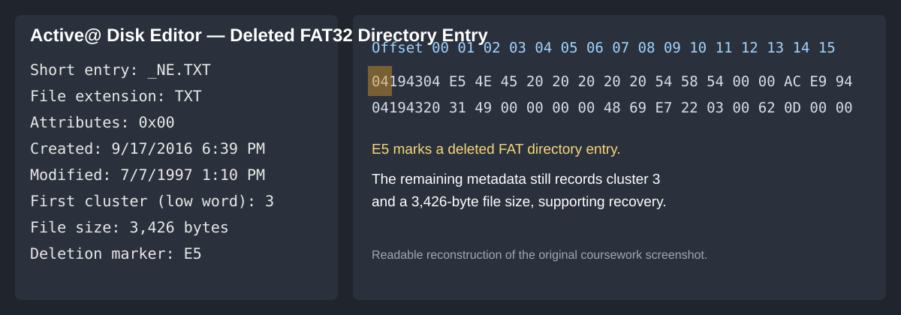
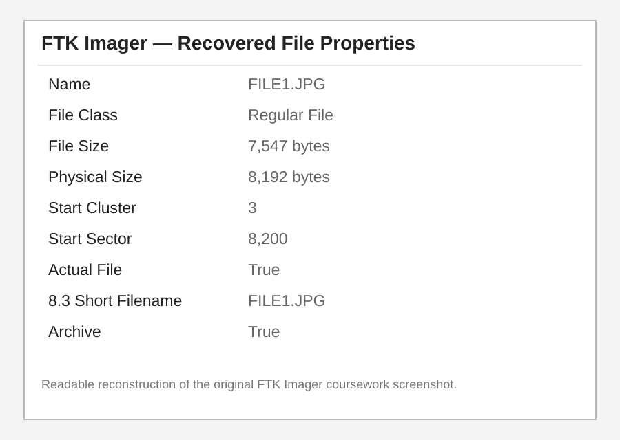
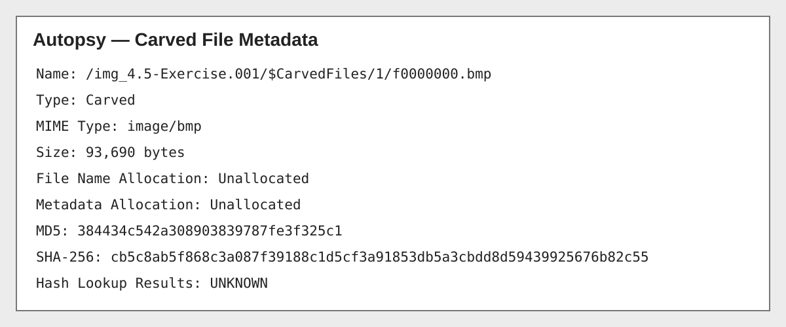

# FAT32 Deleted File Recovery Lab

A portfolio project based on digital forensics coursework involving FAT32 file-system structures, deleted directory entries, cluster chains, hex-level analysis, and recovery workflow documentation.

## Coursework Focus

This project reflects hands-on class exercises using **Active@ Disk Editor**, **FTK Imager**, and FAT32 disk images. The work included examining directory entries, identifying deleted files, interpreting FAT chains, calculating offsets, and restoring deleted directory entries in a controlled lab environment.

## Skills Demonstrated

- FAT32 file-system analysis
- Deleted file and directory entry recovery
- Hexadecimal offset interpretation
- Cluster-chain reconstruction
- Boot sector interpretation
- FAT table analysis
- Directory entry structure analysis
- FTK Imager validation
- Active@ Disk Editor
- Digital evidence documentation

## Lab Highlights

The coursework included recovery of deleted entries by modifying the FAT directory-entry deletion marker and reconstructing file metadata. One exercise involved entries such as:

- `_NE.TXT`
- `_WO.TXT`
- `_HREE.TXT`

Another exercise involved reconstructing a deleted JPEG (`FILE1.JPG`) from a FAT32 image.

## FAT32 Parameters Used in Coursework

- Bytes per sector: 512
- Sectors per cluster: 8
- Cluster size: 4096 bytes
- FAT1 offset: `0x0036D400`
- FAT2 offset: `0x003B6A00`

These values were used to navigate FAT structures and understand how logical clusters map to physical offsets.

## Repository Structure

```text
FAT32-Deleted-File-Recovery-Lab/
├── README.md
├── analysis/
│   ├── fat32-structure.md
│   ├── deleted-entry-recovery.md
│   ├── cluster-chain-reconstruction.md
│   └── findings.md
├── docs/
│   ├── lab-methodology.md
│   └── resume-project-entry.md
├── scripts/
│   └── cluster_offset_calculator.py
├── screenshots/
│   ├── active-directory-entry-detail.svg
│   ├── ftk-file-properties-detail.svg
│   └── autopsy-carved-file-metadata-detail.svg
└── sample-data/
    └── fat32_parameters.csv
```

## Important Note

This repository documents coursework methodology and recreates the technical concepts from the lab. It does **not** distribute the original course disk image or proprietary lab materials.

## Coursework Evidence

The original screenshots recovered from the class work were difficult to read at GitHub's inline size, so the views below are clean, readable reconstructions of the exact information shown in those screenshots. The original screenshot files are still preserved in the repository.

### Active@ Disk Editor — deleted FAT32 directory entry



This view highlights the deleted directory entry, the `E5` deletion marker, first cluster **3**, and file size **3,426 bytes**.

### FTK Imager — recovered FILE1.JPG properties



FTK Imager validation shows `FILE1.JPG` with a file size of **7,547 bytes**, physical size of **8,192 bytes**, start cluster **3**, and start sector **8,200**.

### Autopsy — carved file metadata



The Autopsy view documents a carved BMP in unallocated space, including its **93,690-byte** size and MD5/SHA-256 hash values.

### Original Screenshots

The original recovered class screenshots remain available here for reference:

- [Active@ Disk Editor original screenshot](screenshots/active-disk-editor-directory-entry.jpg)
- [FTK Imager original screenshot](screenshots/ftk-imager-recovered-file.jpg)
- [Autopsy original screenshot](screenshots/autopsy-carved-file-metadata.jpg)
